# Classifying marine animals with CNNs and NN

"Because water is denser than air, sound travels very efficiently underwater. Sounds from some species of marine life and human activity can be heard many miles away and, in some cases, across oceans. 

Passive acoustic instruments record these sounds in the ocean. There are some hydrophones that generate up to 24 terabytes a year! "e.g. Big Data"

This data provides valuable information that helps government agencies and industries understand and reduce the impacts of noise on ocean life.

By listening to sensitive underwater environments with passive acoustic monitoring tools, we can learn more about migration patterns, animal behavior and communication."
[quoted from noaa](https://noaa.maps.arcgis.com/apps/Cascade/index.html?appid=c653c78262a7487da42149ebc86f80c2)

The goal of this project is to explore marine animals classification. I will be implementing two machine learning models, a neural network and convolution neural network. The marine animals that I'll be classifying are:

* Killer Whale
* False Killer Whale
* Bowhead Whale
* White Sided Dolphin
* Risso Dolphin
* Northern Right Whale
* Humpback Whale
* Sperm Whale
* Short Finned Pilot Whale 

# About the Data

This project will use the labeled data from:

* [Watkins Whale Database](https://cis.whoi.edu/science/B/whalesounds/index.cfm)

* [Monterey Bay Research Institute](https://www.mbari.org)

* [AudioSet: YouTube](https://research.google.com/audioset/)

# Preparing data for classification

* All the audio files were sliced into 30 second clips. Audio files that were longer than 30 seconds were decomposed into lengths of 30 seconds clips which helped generate more data. 

* Next I duplicated all the audio files per class and augmented those halves. I randomly augmented each file 
    * +/- 3 dB , 
    * +/- 2 semitones, 
    * time stretch 
    * and added some noise. 
    
* This doubled the size of data in each class where exactly half of the data in each class is an augmented version of the original file. 

Here is some exploratory visual representations of each class using spectrograms and oscillograms.

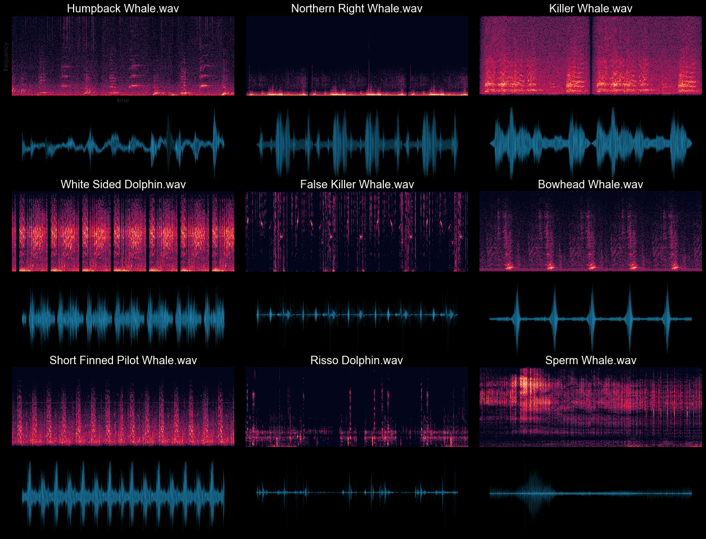 

## Extract Mel-Frequency cepstral coefficients (MFCCs) using Librosa.
[MFCCs wiki](https://en.wikipedia.org/wiki/Mel-frequency_cepstrum)

* extracted 10 segments (MFCCs) every 3 seconds on all 30 seconds audio files. 

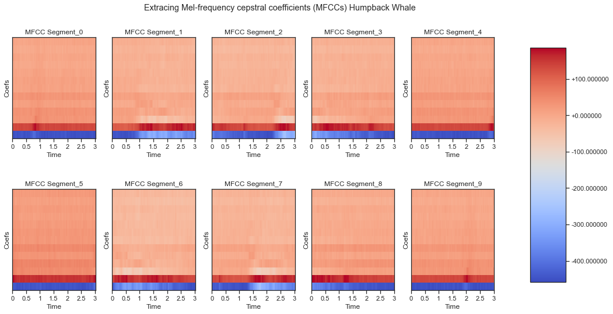

# Models

## Classifying using NNs

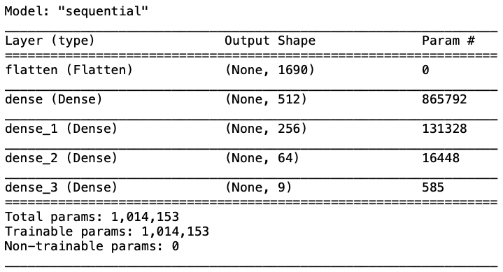
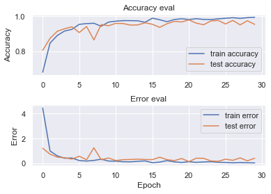
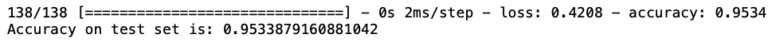

## Display a confusion matrix
A confusion matrix is helpful to see how well the model did on each of the marine animals in the test set. 

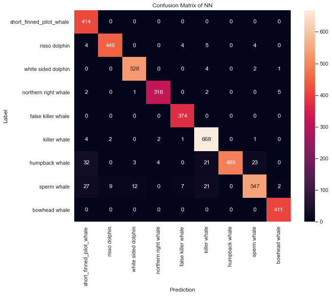

## Classifying using CNNs

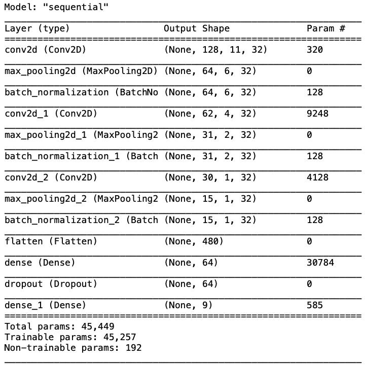

## Evaluate test set performance
running the model on the test set and check performance. 

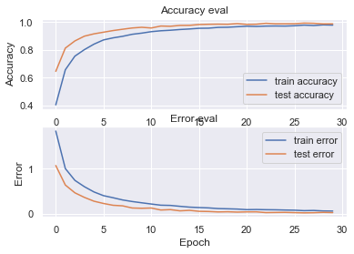

## Evaluate test set performance
running the model on the test set and check performance. 

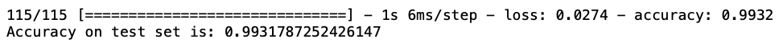

## Display a confusion matrix
A confusion matrix is helpful to see how well the model did on each of the marine animals in the test set. 

# Run inference on a new audio source"
Finally, verifying the models' prediction output using an input audio outside of dataset.

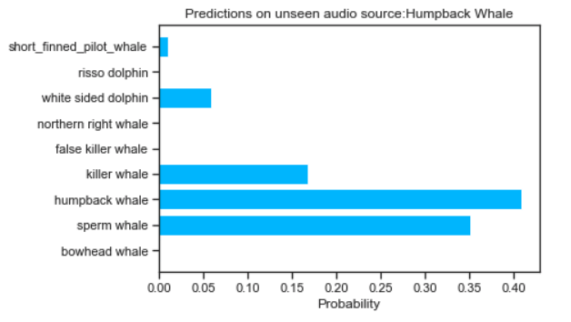
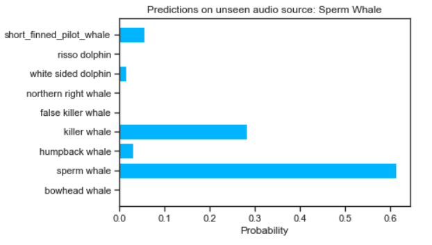

<>