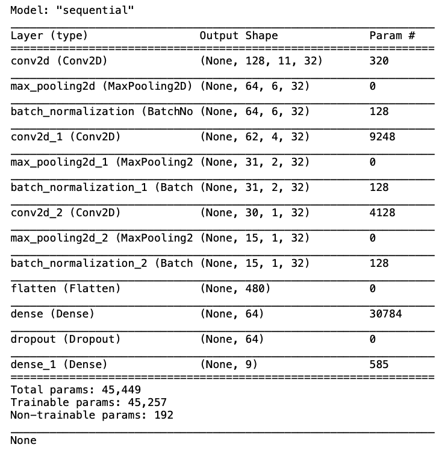
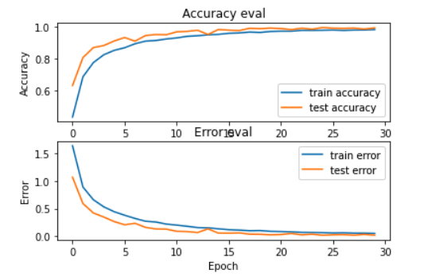
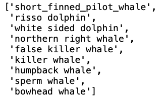

# Classifying marine animals with CNNs and NN

"Because water is denser than air, sound travels very efficiently underwater. Sounds from some species of marine life and human activity can be heard many miles away and, in some cases, across oceans. 

Passive acoustic instruments record these sounds in the ocean. There are some hydrophones that generate up to 24 terabytes a year! "e.g. Big Data"

This data provides valuable information that helps government agencies and industries understand and reduce the impacts of noise on ocean life.

By listening to sensitive underwater environments with passive acoustic monitoring tools, we can learn more about migration patterns, animal behavior and communication."
[quoted from noaa](https://noaa.maps.arcgis.com/apps/Cascade/index.html?appid=c653c78262a7487da42149ebc86f80c2)

<hr>
The goal of this project is to explore marine animals classification. I will be implementing two machine learning models, a neural network and convolution neural network. The marine animals that I'll be classifying are:

* Killer Whale
* False Killer Whale
* Bowhead Whale
* White Sided Dolphin
* Risso Dolphin
* Northern Right Whale
* Humpback Whale
* Sperm Whale
* Short Finned Pilot Whale 

<hr>

# About the Data

This project will use the labeled data from:

* [Watkins Whale Database](https://cis.whoi.edu/science/B/whalesounds/index.cfm)

* [Monterey Bay Research Institute](https://www.mbari.org)

* [AudioSet: YouTube](https://research.google.com/audioset/)


<hr>

# Preparing data for classification

* All the audio files were sliced into 30 second clips. Audio files that were longer than 30 seconds were decomposed into lengths of 30 seconds clips which helped generate more data. 

* Next I duplicated all the audio files per class and augmented those halves. I randomly augmented each file 
    * +/- 3 dB , 
    * +/- 2 semitones, 
    * time stretch 
    * and added some noise. 
    
* This doubled the size of data in each class where exactly half of the data in each class is an augmented version of the original file. 

* Audio samples of each class at 30 seconds.

 


# Audio preprocessing:

* Audio must be converted to wav format for parsers and audio concat to work properly.

Once we have our training dataset we will proceed to Pre-process our audio to MFCCs. Here, we will take a MFCCs every 3 seconds of each audio track in each class. The audio is down sampled to 22050 and mono. We will walk through the training data set directories applying pre-processing to each class. The pre-processing python file will export our MFCCs, Labels and mappings for each class into a json file. 

* NOTE before preprocessing MFCCs check the training data set directory in the terminal with: 

```bash
find . -name ".DS_Store" -print


find . -name ".ipynb_checkpoints" -print


add -delete if you find any before creating the MFCC dataset.
```


# Training CNN and Evaluating:





## Confusion matrix


<hr>

# Saved the entire model as "SaveModel format" and retrain on mel spectrograms.

<hr>

# Run Inference on unseen audio source "specifically from youtube & MBARI."


<>